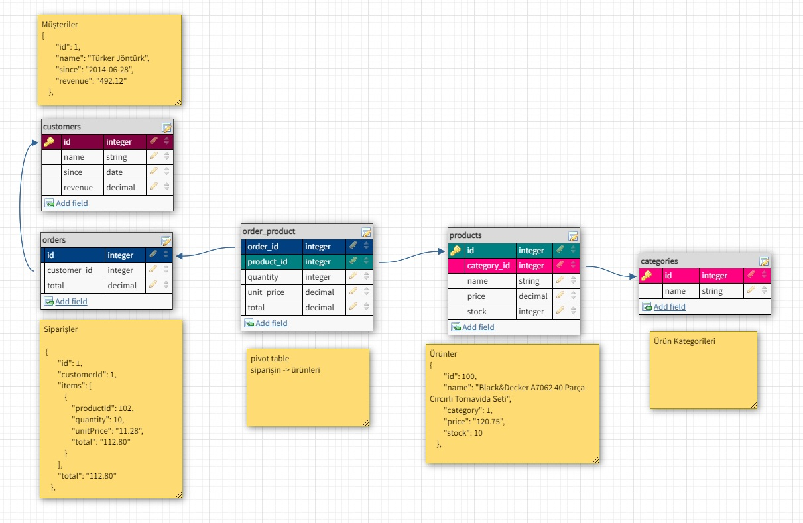
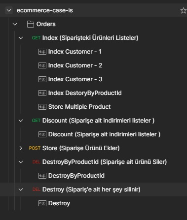
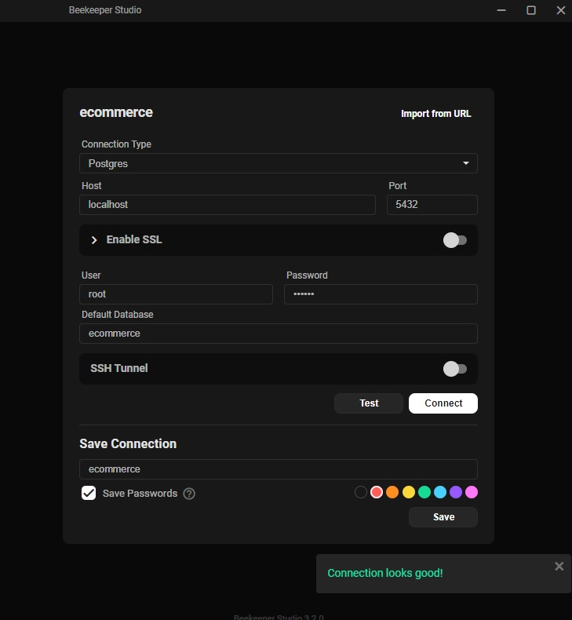

## Installation

### Docker Compose Install & Run
```
docker compose up -d
```

### Database Create
Veritabanı otomatik oluşmaz ise manuel oluşturabilirsiniz:
```
CREATE DATABASE ecommerce
```
### Migration
```
php artisan migrate
```

### Seed ( Dummy Data )
```
php artisan db:seed
```

### Migrate Fresh & Seed
Veritabanını dummy data ile birlikte tekrar oluşturmak için
```
php artisan migrate:fresh --seed
```
## About
Postman API ve Example Request için:\
https://documenter.getpostman.com/view/14752307/UzR1J2f9
\
VEYA [Postman API Collection İndirmek İçin Tıklayın](https://github.com/muratcakmaksoftware/ecommerce-case-is/blob/master/docs/download/PostmanExport/ecommerce-case-is.postman_collection.json)

- Case olduğundan Authentication eklenmemiştir bunun yerine Test için app/Helpers/helpers.php içerisinde CustomerId belirtilmiştir.
- Repository Design Pattern kullanılmıştır.\
 (Controller => Service => RepositoryInterface => Repository)
- Trait, Stubs, Requests(FormRequest), Enums kullanılmıştır
- Dependency Injection kullanılmıştır.
- Dummy Data için factory & faker kullanılmıştır.

### File Structure
Ek olarak geliştirilmiş dosyaları daha iyi görmenizi sağlar:
```
|-- app
|   |-- Console / Commands
|   |-- Enums
|   |   `-- OrderStoreStatus.php
|   |-- Helpers
|   |   `-- helpers.php
|   |-- Http
|   |   `-- Controllers
|   |       `-- OrderController.php ...
|   |   `-- Requests
|   |       `-- StoreOrderRequest.php
|   |-- Models
|   |   `-- Order.php
|   |   `-- Customer.php
|   |   `-- ...
|   |-- Interfaces
|   |   |-- RepositoryInterfaces
|   |   |   `-- BaseRepositoryInterface.php
|   |   |   `-- OrderRepositoryInterface.php
|   |   |   `-- ProductRepositoryInterface.php
|   |-- Providers
|   |   `-- AppServiceProvider.php
|   |   `-- RepositoryServiceProvider.php
|   |-- Repositories
|   |   `-- BaseRepository.php
|   |   `-- OrderRepository.php
|   |   `-- ProductRepository.php
|   |-- Services
|   |   `-- BaseService.php
|   |   `-- OrderService.php
|   |   `-- ProductService.php
|   |-- Traits
|   |   `-- APIResponseTrait.php
|   |-- database
|   |   |-- factories
|   |   |   `-- CategoryFactory.php
|   |   |   `-- CustomerFactory.php
|   |   |-- migrations
|   |   |   `-- 2014_10_12_000000_create_customers_table.php
|   |   |   `-- 2022_07_20_134408_create_orders_table.php ...
|   |   |-- Seeders
|   |   |   `-- OrderSeeder.php
|   |   |   `-- DatabaseSeeder.php ...
|   |-- docker
|   |   |-- images
|   |   |-- images
|   |   |   |-- nginx
|   |   |   |-- php
|   |   |   |-- postgresql
|   |-- routes
|   |   `-- api.php
|   |`-- .env
|   |`-- docker-compose.yml
|   |-- stubs
```

### Preview

#### Database


#### Postman API


#### DB Connection

